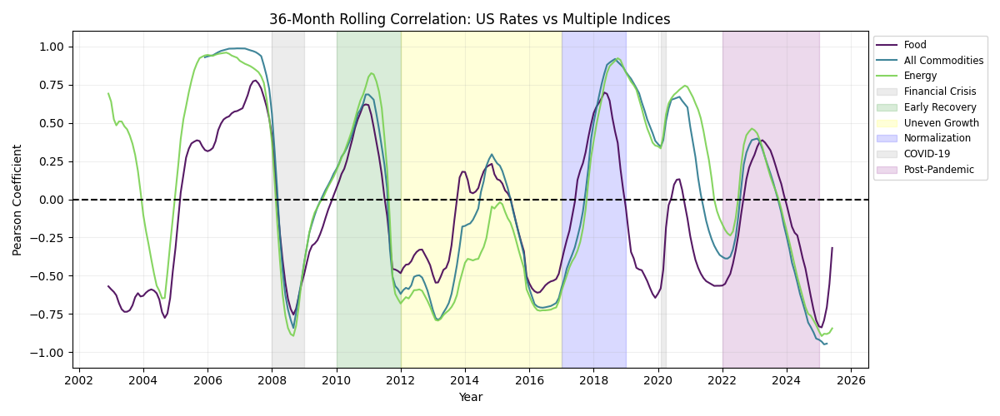
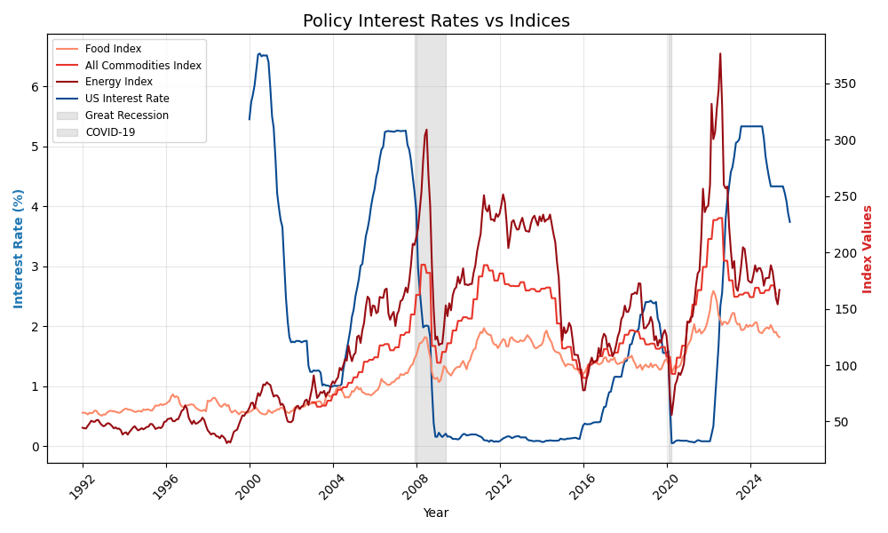

# Monetary Policy vs Commodity Prices

A small data analysis project exploring how U.S. interest rates and global commodity prices have moved together (or not) over time.

The goal of this project was to practice working with economic time-series data, build clear visualizations, and learn how macroeconomic relationships change across different periods.

---

## What This Project Does

- Pulls U.S. interest rate data and global commodity price indices
- Uses rolling correlations to see how their relationship changes over time
- Compares energy, food, and broad commodity prices
- Visualizes major economic periods like the 2008 crisis, COVID, and the post-pandemic inflation spike

This is **exploratory analysis**, not a forecasting or trading model.

---

## Visualizations

---

## Key Takeaways (High Level)

- The relationship between interest rates and commodity prices is **not constant**
- During stable growth periods, rates and prices often move together
- During crises or supply shocks, the relationship can weaken or reverse
- Food prices are less responsive to interest rates than energy prices

---

## Tech Stack

- Python
- Pandas / NumPy
- Matplotlib
- Jupyter Lab
- FRED API

---

## Why I Built This

I’m a computer science graduate moving into data analysis, and I built this project to:

- Work with real-world time-series data
- Improve my data visualization skills
- Practice explaining results clearly without over-complicating them

---

## Notes

This project focuses on visualization and pattern recognition.  
It intentionally avoids making causal claims about monetary policy.

---

Joshua Oppenheimer  
GitHub: https://github.com/jppnhmr

---
## Install
> pip install -r requirements.txt

## Usage
Setup database and collect data
> python -m src.run